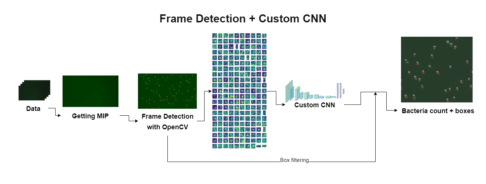
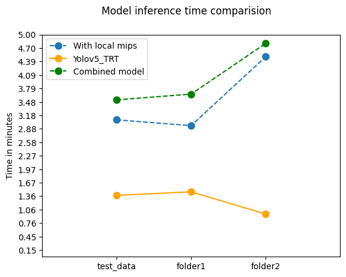
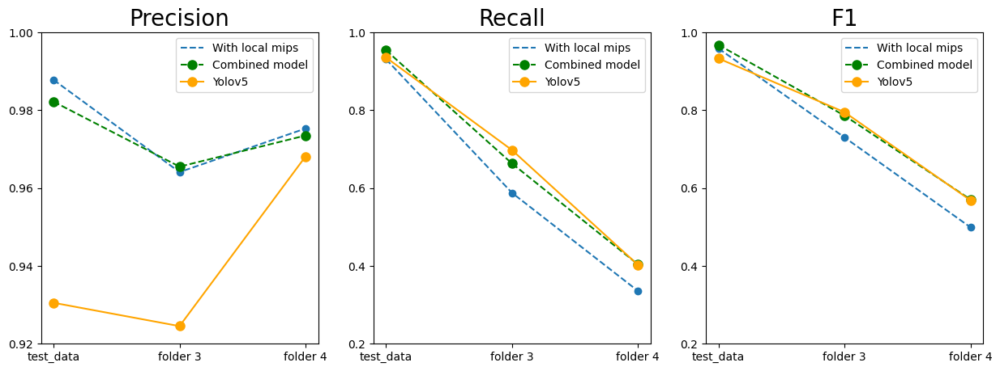

# Bacteria Detection

The goal of the project is to get the bacteria count from multiple continuously pictured frames for a single area. Currently, the best results in terms of time and accuracy are with [YOLOv5 object detection model](https://github.com/ultralytics/yolov5).

## How to use
To run the detection, type the following command:

> `python3 detect.py --source SOURCE [--engine ENGINE] [--frame-weights FRAME_WEIGHTS] [--conf-thres CONF_THRES] [--iou-thres IOU_THRES] [--agc-distance AGC_DISTANCE] [--out-path OUT_PATH] [--save-results]`

- `--source SOURCE` : Path to the folder of images for detection (should be either a single folder, or a folder that contains multiple folders with images)
- `--engine ENGINE` : The path to the engine file
- `--frame-weights FRAME_WEIGHTS` : Path to the frame weights
- `--conf-thres CONF_THRES` : The minimum confidence threshold for the detections
- `--iou-thres IOU_THRES` : The IOU threshold for YOLO NMS
- `--agc-distance AGC_DISTANCE` : The maximum distance between elements of cluster for bacteria
- `--out-path OUT_PATH` : The root directory where the results will be saved
- `--save-results` : If option is selected the mip with detections on it, detected boxes and detection time info will be saved.

## Example
> `python3 detect.py --source examples/test_data/images --save-results --out_path examples/test_data/detection`

## Requirements
If one of these scripts was not run before, run the one with a compatible version of Nvidia-Jetpack on your device.
- `setup_JDK_Nano_4.5.1-b17.sh`
- `setup_JDK_Nano_4.6.1-b110.sh` 

A command to check the Jetpack version of your device:
> `sudo apt-cache show nvidia-jetpack`

Otherwise, run the following command as a super-user (**sudo**) 
> `pip install -r requirements.txt && path5='export LD_PRELOAD={$LD_PRELOAD}:"/usr/local/lib/python3.6/dist-packages/scikit_learn.libs/libgomp-d22c30c5.so.1.0.0"' && echo "$path5" >> ~/.bashrc`

## Project's Pipeline

**Data**
- There were many microscope folders, each containing around 238 images with contiguous focal depth for a single area.

**Main Pipeline**
- The data was not labeled, and to fix it, different methods were tried:
  1. **Classic algorithm with OpenCV** to find the bright areas(possibly bacteria) in the MIP(Maximum Intensity Projection). Then the boxes of those areas were used as labels for modified YOLOv5(to get as an input 20 channel patches). With this method, the results were not promising.
  2. Create a '[**Custom classification CNN**](https://gitlab.com/sven.badalyan/testo_jetson/-/tree/main)' which will determine if the selected box is a bacteria or not. Frame detection(the algorithm with OpenCV) results were used as labels for the training of the net. The network takes as an input crops of bacteria, and for each crop, returns 1 if a crop is determined as a bacterium and 0 otherwise. The results with this approach have a lot higher accuracy, but for some bright areas, the model gives wrong predictions.  
  3. Create a '[**Combined model (CNN+Dense)**](https://gitlab.com/sven.badalyan/testo_jetson/-/tree/local_mip_density_std_branch)' which will take the density scores and a crop for each area proposed by the frame detection and according to those classify whether the crop is a bacteria or not. A new custom small DenseNet was merged with the classification CNN. The results are very good, many of the previous major errors were eliminated but still, frame detection has limits for detecting multiple bacteria which are stitched together, as it takes them as a single area.   
  4. **Use YOLOv5**
     1. **Train YOLOv5** with its augmentations. Use the combined model for generating good labels. Filter the frames where boxes big area exists (those boxes are mostly the ones that contain multiple bacteria), so that wrong data is not fed to the YOLOv5s. After the above steps, YOLOv5 started to detect bacteria better and better, as the data was cleaned up. When the results were satisfying, enough optimizations were needed for the model to work on Jetson Nano as fast as possible.
     2. Train **YOLOv5(nano)**. Convert the trained model into a **TensorRT** engine for speed-up. Create a script for detecting bacteria frame-by-frame and merge detection on all frames correctly, without losing stitched bacteria. For that purpose, Agglomerative Clustering is used.  

## Comparisons
  
From the above comparison, we can see that with YOLO_v5 TensorRT, the detection is a lot faster than with the previous approaches. In addition to that, YOLOv5 has a huge potential to detect stitched bacteria. Below you can see the comparison between previous models and YOLOv5_TRT.
  
  
